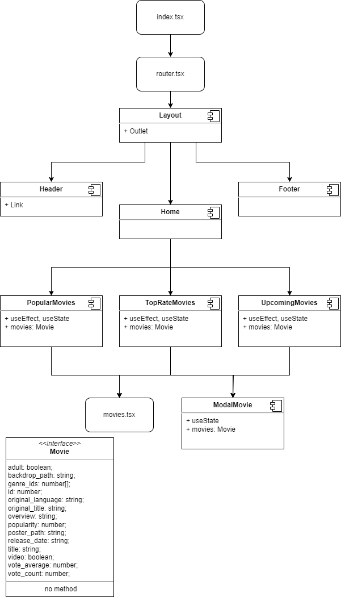

# 타입스크립트, 리엑트, 장고를 이용한 영화사이트

## 기술스택

## 컴포넌트 구조도

## 프론트엔드 개발
타입스크립트, 리엑트, Axios를 사용하여 개발을 진행했습니다.

타입스크립트를 처음 사용하다 보니, 부모 컴포넌트에서 자식 컴포넌트로 data를 보내는 과정에서 타입처리가 힘들었습니다.
interface.ts에 데이터 타입을 정리하여 해결하였습니다.

Axios로 TMDB의 open API와 통신을 하여 영화 데이터를 가져왔습니다. 영화 데이터의 타입을 interface.ts에 정의하여 사용했습니다.